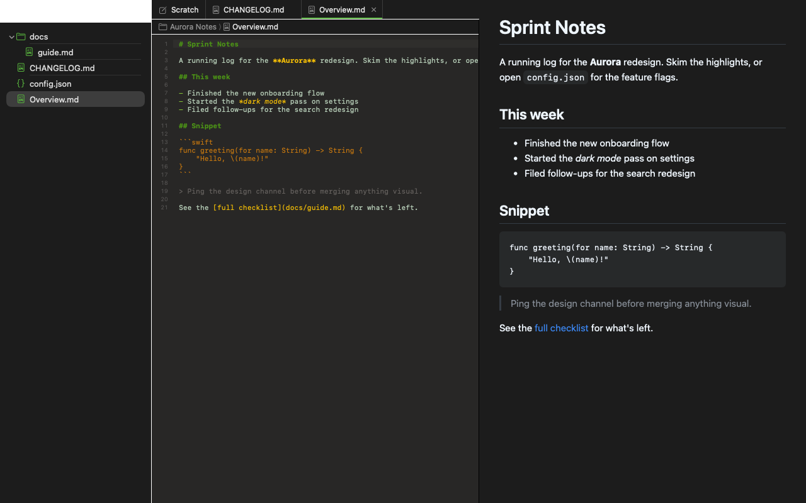
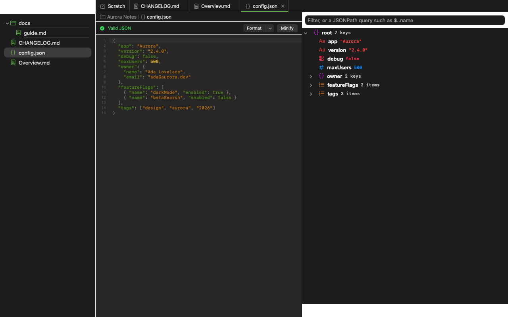

# LF-Paper

A native macOS workbench for Markdown and JSON: open a folder, edit files in tabs with syntax
highlighting, preview Markdown live, and work with JSON with a validating editor, a tree view,
schema checking, comparison and conversion tools.

Requires macOS 15 (Sequoia) or later to run. Building it needs Xcode 26.5.





## Install

With [Homebrew](https://brew.sh):

```bash
brew install --cask alifu/tap/lf-paper
```

Update and uninstall:

```bash
brew upgrade --cask lf-paper
brew uninstall --cask lf-paper          # add --zap to also remove its settings and data
```

Or download `LF-Paper.zip` from the [latest release](https://github.com/alifu/LF-Paper/releases/latest),
unzip it and drag `LF-Paper.app` into `/Applications`.

### "LF-Paper can't be opened" warning

LF-Paper isn't notarized by Apple (that needs a paid developer account), so macOS blocks it the
first time you open it. You only have to allow it once:

1. Open LF-Paper. macOS shows a warning that it couldn't verify the app; click **Done**.
2. Open **System Settings › Privacy & Security** and scroll down to the **Security** section.
3. Next to "LF-Paper was blocked to protect your Mac", click **Open Anyway**, then confirm with your
   password or Touch ID and click **Open Anyway** again.

Or, from the Terminal, remove the quarantine flag instead:

```bash
xattr -dr com.apple.quarantine /Applications/LF-Paper.app
```

## Features

**Folder workspace**
- Open a folder and browse its file tree: create, rename, move to the Trash, and reveal in Finder.
- Files open in tabs, each with its own undo history; unsaved changes are marked and asked about
  before closing. Autosave a moment after you stop typing, if you turn it on.
- Quick Open (⌘P) jumps to any file by name; Find in Folder (⇧⌘F) and Replace in Folder (⌥⇧⌘F)
  search every file, with a preview and an undo for the replacement.
- A path bar above the editor shows where the open file lives; click a part of it to reveal that
  folder or file in the sidebar.
- A scratchpad tab for throwaway text, such as a prompt you're about to paste elsewhere. It's
  never saved or counted as an unsaved change.

**Markdown**
- Syntax highlighting for headings, emphasis, links, quotes, lists and fenced code.
- A live preview beside the editor, with scrolling kept in sync between the two, and an outline
  sidebar listing the file's headings.
- Export to HTML or PDF.

**JSON**
- Validation with the exact error position, plus Format and Minify.
- A tree view of the document that you can expand, collapse and search; searches starting with
  `$` are JSONPath queries.
- Schema validation against a `$schema` reference or a file you choose, with each problem linked
  back to its place in the document.
- Convert to YAML or CSV, or back to JSON.
- Generate Swift models from a JSON document — Codable structs, classes, or dictionary-based
  models reading `[String: Any]` — with a live preview of the generated code before it's saved.

**Comparing files**
- Compare any two JSON or text documents, or a file with the version last saved or the version in
  the last Git commit, with a side-by-side or unified diff.

**Editor**
- A choice of editor theme: GitHub (the default), Hyrule, or the system's colours, each with a light and
  a dark variant. GitHub and Hyrule are from [Rainglow](https://rainglow.io).
- A custom theme: pick your own editor colours for light and dark mode in Settings › Editor theme › Custom.
- Large files and very long lines are handled without slowing down typing.

## Development

Clone the repository and open `LF-Paper.xcodeproj` in Xcode 26.5, then run the `LF-Paper` scheme.

Unit tests (the UI tests take over the mouse and keyboard, so run those by hand from Xcode):

```bash
xcodebuild test -project LF-Paper.xcodeproj -scheme LF-Paper -destination 'platform=macOS' -only-testing:LF-PaperTests -skipPackagePluginValidation
```

SwiftLint runs as a build plugin (only the file-length rule, 800 lines). Xcode asks once to trust
it; command-line builds need `-skipPackagePluginValidation`, as above.

## Credits

- **GitHub**, **GitHub Light**, **Hyrule** and **Hyrule Light** editor themes from [Rainglow](https://rainglow.io) by Dayle Rees (MIT License).
- [swift-cmark](https://github.com/swiftlang/swift-cmark) for Markdown (BSD 2-Clause License).
- [Yams](https://github.com/jpsim/Yams) for YAML (MIT License).
